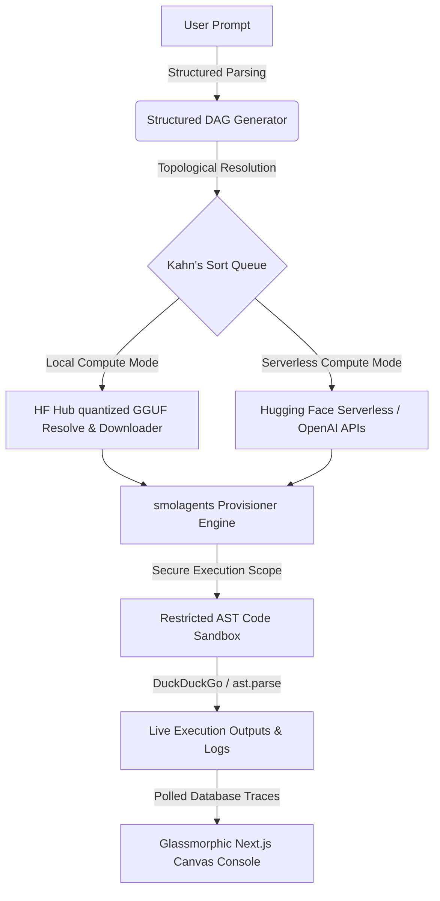

# 🌌 CHARVIS 
> **The Open-Source AI Agent Pipeline Generator & Hybrid Compute Orchestrator**

[](https://fastapi.tiangolo.com)
[](https://nextjs.org)
[](https://github.com/huggingface/smolagents)
[]()
[]()

```text
  _____ _    _          _____  __      _______  _____ 
 / ____| |  | |   /\   |  __ \ \ \    / /_   _|/ ____|
| |    | |__| |  /  \  | |__) | \ \  / /  | | | (___  
| |    |  __  | / /\ \ |  _  /   \ \/ /   | |  \___ \ 
| |____| |  | |/ ____ \| | \ \    \  /   _| |_ ____) |
 \_____|_|  |_/_/    \_\_|  \_\    \/   |_____|_____/ 
```

Charvis is an open-source, enterprise-grade AI execution platform that translates natural language requirements into **modular Directed Acyclic Graphs (DAG) of specialized, tool-calling AI agents**. 

Equipped with a **Dual-Compute Layer Strategy**, Charvis dynamically provisions and resolves pipelines locally (offline GGUFs fetched from the Hugging Face Hub) or serverless (API fallbacks) using a **highly-secured isolated AST sandbox engine**. Live execution is visualised via a gorgeous glassmorphic React Flow canvas and polished real-time polling logs terminal.

---

## 📐 Platform Architecture

Charvis acts as a compilation bridge between abstract human text and functional model runtime execution. 



### The Orchestration Lifecycle

1. **Structured Synthesis (`pipeline_generator.py`)**: Resolves requests (e.g. *"Search news about Mars, analyze using python inside sandbox, and translate report to French"*) into a cycle-free Pydantic DAG structure using LLMs or a zero-config keyword fallback.
2. **Topological Execution Flow (`executor.py`)**: Arranges nodes topologically using **Kahn's Algorithm**. Downstream steps consume upstream output variables, and cascading rules automatically mark subsequent blocks as failed if parent tasks abort.
3. **Dual-Compute Routing (`agent_engine.py`)**: Provisions specialized tools (Web Search, File I/O, Python AST Sandbox) and runs inference using local GGUF models or remote API fallbacks.
4. **AST Sandbox Safeguard (`sandbox.py`)**: Intercepts Python tool-calling, runs code validation against whitelists, blocks built-in dangers, and terminates threads upon timeout.

---

## 🛡️ AST Python Sandbox Safety Specs

To prevent data corruption, server hijacking, or infinite runtimes during agent code generation, Charvis executes all script actions within a highly isolated custom static compiler layer.

| Feature / Attribute | Sandbox Policy | Rationale |
| :--- | :--- | :--- |
| **Whitelisted Libraries** | `math`, `json`, `datetime`, `random`, `re`, `collections`, `statistics`, `itertools`, `urllib.parse` | Enables advanced mathematical and analytical logic without network exposure. |
| **Dangerous Imports** | **Strictly Forbidden** (`os`, `sys`, `subprocess`, `shutil`, `socket`, `ctypes`, etc.) | Prevents command shell injection, external host connections, and file destruction. |
| **Dangerous Built-ins** | **Stripped/Blocked** (`exec`, `eval`, `open`, `__import__`, `getattr`, `globals`) | Intercepts runtime manipulation and unauthorized system file access. |
| **Dunder Attributes** | **Forbidden** (`__class__`, `__subclasses__`, `__bases__`, etc.) | Blocks standard object breakout chains designed to bypass standard whitelists. |
| **Execution Bounds** | **5.0-Second Timeout** | Spawns a dedicated daemon thread to safely abort loops (e.g. `while True:`). |

### Sandbox Validation Example

```python
# 🚫 BLOCKED: The AST parser intercepts this before execution starts
import os
os.system("rm -rf /") 
# Output Exception: Security Sandbox Violation: Import of module 'os' is forbidden.

# 🚫 BLOCKED: Double underscores are blocked statically
[].__class__.__base__
# Output Exception: Security Sandbox Violation: Access to double-underscore attribute '__class__' is forbidden.

# ✅ ALLOWED: Analysing complex structures within safety parameters
import math
import json
data = [12.5, 45.2, 98.1]
result = {"mean": sum(data)/len(data), "sin_sum": sum(math.sin(x) for x in data)}
print(json.dumps(result))
# Output: {"mean": 51.93, "sin_sum": 0.323}
```

---

## 📂 Project Anatomy

```text
charvis/
├── backend/
│   ├── app/
│   │   ├── services/
│   │   │   ├── pipeline_generator.py # Prompt -> Pydantic DAG Layout
│   │   │   ├── hf_downloader.py      # Programmatic GGUF download resolver
│   │   │   ├── agent_engine.py       # smolagents custom orchestrator
│   │   │   ├── executor.py           # Topological DAG run controller
│   │   │   └── sandbox.py            # Static AST Safety Sandbox
│   │   ├── database.py               # SQLAlchemy SQLite/PostgreSQL setup
│   │   ├── models.py                 # ORM structural layout tables
│   │   ├── schemas.py                # REST Pydantic validation rules
│   │   ├── config.py                 # Environment and default driver config
│   │   └── main.py                   # FastAPI routing and CORS setup
│   ├── requirements.txt              # Backend framework libraries
│   └── .env                          # Local database and API keys
├── frontend/
│   ├── src/
│   │   ├── app/
│   │   │   ├── globals.css           # Glowing transitions, nodes stylesheet
│   │   │   ├── layout.tsx            # Metadata browser title envelope
│   │   │   └── page.tsx              # Glassmorphic React Flow Dashboard
│   └── package.json                  # Next.js configurations
└── runner.py                         # Standalone offline CLI runner
```

---

## ⚙️ Configuration Variables

Configure parameters in the `backend/.env` file. If left blank, Charvis defaults to an **instant offline SQLite setup**:

| Env Parameter | Default / Options | Purpose |
| :--- | :--- | :--- |
| `DATABASE_URL` | `sqlite:///./charvis.db` | Target database connection. Supports standard PostgreSQL. |
| `OPENAI_API_KEY` | *Optional* | Together AI, DeepInfra, or OpenAI API Keys for pipeline synthesis. |
| `OPENAI_API_BASE` | `https://api.openai.com/v1` | Custom endpoint routing. |
| `LLM_MODEL` | `gpt-4o-mini` | Target parsing model. |
| `HF_TOKEN` | *Optional* | Access private or gated models on the Hugging Face Hub. |
| `LOCAL_CACHE_DIR`| `~/.cache/huggingface` | Direct download directory for GGUF model snapshots. |

---

## 🛠️ Step-by-Step Installation & Quickstart

Ensure you have **Python 3.10+** and **Node.js 18+** ready on your system.

### Step 1: Boot the FastAPI Backend

Open a terminal window and set up the Python environment:

```bash
cd backend

# Initialize and activate Python virtual environment
python3 -m venv venv
source venv/bin/activate

# Install package dependencies
pip install -r requirements.txt

# Boot the API server (will spin up SQLite table structures on first run)
uvicorn app.main:app --reload --port 8000
```
Your backend is online on **[http://localhost:8000](http://localhost:8000)**!

### Step 2: Boot the Next.js Visual Dashboard

Open a separate terminal window and set up the React client:

```bash
cd frontend

# Install package dependencies
npm install

# Start Next.js development client
npm run dev
```
Open **[http://localhost:3000](http://localhost:3000)** in your browser!

### Step 3: Run Pipelines from the Terminal (Offline CLI)

You can run pipelines entirely offline from your terminal using the standalone CLI runner script:

```bash
# Ingest local user inputs and run via serverless fallback API
python runner.py --pipeline sample_pipeline.json --mode SERVERLESS --input user_query="Google I/O 2026 AI news"

# Execute a Python analysis pipeline offline utilizing local cached GGUF model files
python runner.py --pipeline sample_pipeline.json --mode LOCAL --input raw_data="item,count\nbanana,5\napple,12"
```
Logs are printed in real-time to standard output, and final context values are stored inside `pipeline_results.json`.

---

## 🛡️ License

Charvis is open-source software released under the [MIT License](https://opensource.org/licenses/MIT). Build, run, and orchestrate agent DAG pipelines locally with absolute data privacy!
